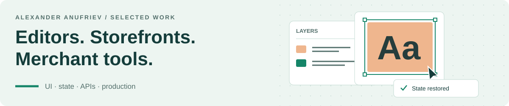

# Alexander Anufriev

### Senior Frontend Engineer · Vue · TypeScript · Nuxt

<picture>
  <source
    media="(max-width: 600px) and (prefers-color-scheme: dark)"
    srcset="assets/workbench-mobile-dark.svg"
    width="700" height="240"
  />
  <source
    media="(max-width: 600px)"
    srcset="assets/workbench-mobile-light.svg"
    width="700" height="240"
  />
  <source
    media="(prefers-color-scheme: dark)"
    srcset="assets/workbench-dark.svg"
    width="1200" height="252"
  />
  
</picture>

  
  
  
  
  

I'm a Senior Frontend Engineer with **5 years of production experience**, mainly with Vue and TypeScript. At [inSales](https://www.insales.ru/), an e-commerce SaaS platform serving **60,000+ merchants**, I built visual editors, storefront infrastructure, and merchant-facing tools.

I take frontend work from requirements and API contracts through architecture, testing, and release.

**Open to remote frontend roles in an international team.** Batumi, Georgia · B2B / EOR · English C1 · Open to employer-sponsored relocation

## Product work at inSales

### 01 / Product image editor

**3,000+ active clients · Two production workflows · 800+ AI operations a day**

I built the Vue interface and owned its frontend architecture, working with product, design, backend, and QA. Merchants can save editable projects, reuse templates, and use AI-assisted background removal, upscaling, and text generation in product-image and site-image workflows.

The screenshot shows the commercial application. Its reusable canvas engine is my [public TypeScript library](#fabric-image-editor).

### 02 / Storefront systems

**CommonJS storefront library.** I modernized the shared JavaScript library behind product pages, cart interactions, and checkout. Webpack 5, tree shaking, and dependency cleanup reduced the **compressed bundle from over 300 KB to 168 KB**. AJAX loading and IndexedDB caching reached **10+ standard templates**, with approximately **70% fewer product-data requests**.

**Product options and add-ons.** I built reusable selection controls and extended the cart API. Different add-on combinations stay separate in the cart; quantity changes target the selected combination, while availability checks account for their combined quantity for the same product variant.

### 03 / Merchant tools and shared editors

- **Abandoned Carts:** sole frontend developer for a paid product with **200+ active subscribers**. Delivered analytics, cart details, reminders, and trial/subscription states from requirements through release
- **Visual site editor:** implemented the frontend redesign used by **over 90% of stores** and built recovery mode for broken storefront previews. The share of new users who independently changed a template or widget setting and saved it in their first session rose **from 60% to 80%**
- **Code editor:** built a shared Monaco-based editor for **5 product workflows**, including context-aware HTML/Liquid autocomplete. Remained its primary maintainer for **over 3 years**
- **Text editor:** created and integrated a platform-wide custom editor across **10+ text workflows**, with AI tools to generate, rephrase, and expand content
- **Vue 3 migration:** contributed to the production migration from Vue 2, resolving compatibility issues and performance regressions in the existing codebase

[Project presentations](https://www.linkedin.com/in/alexander-s-anufriev/details/projects/) · [Recommendations from colleagues](https://www.linkedin.com/in/alexander-s-anufriev/details/recommendations/)

## Public code you can try

### Fabric Image Editor

**TypeScript · Fabric.js · Web Workers · Jest · Playwright**

I built the reusable engine behind the production Vue editor: canvas interactions, rich text, layers, history, templates, and import/export, with full editable-state serialization and restoration. The difficult part is keeping objects consistent across creation, copy/paste, template restore, and undo/redo. I improved image loading by **over 2×** and moved heavy import/export work to Web Workers.

  
  
  

### Relevator Events

**Nuxt 4 · Vue 3 · TypeScript · Tailwind CSS · DatoCMS · GraphQL**

An event directory I built as a frontend take-home assignment. It has server-rendered detail pages, a paginated feed, typed CMS integration, and loading and recovery states. Tests cover navigation, direct URLs, pagination, and narrow screens. A bundled local demo works without a CMS account.

  
  

## How I work

Before frontend engineering, I worked in **Support Engineering at inSales**. That gave me practical experience with merchants' workflows, difficult storefront issues, and explaining technical behavior to colleagues.

- **Frontend:** Vue 2/3, TypeScript, JavaScript, Nuxt, Composition API, Pinia, Vuex
- **Interfaces and data:** HTML/CSS, Sass, Tailwind CSS, Fabric.js, REST APIs, GraphQL
- **Delivery:** Jest, Playwright, Vite, Webpack, Git, GitHub Actions

**Let's talk:** [alexander.s.anufriev@gmail.com](mailto:alexander.s.anufriev@gmail.com) · [LinkedIn](https://www.linkedin.com/in/alexander-s-anufriev/) · [Telegram](https://t.me/anu3ev)
